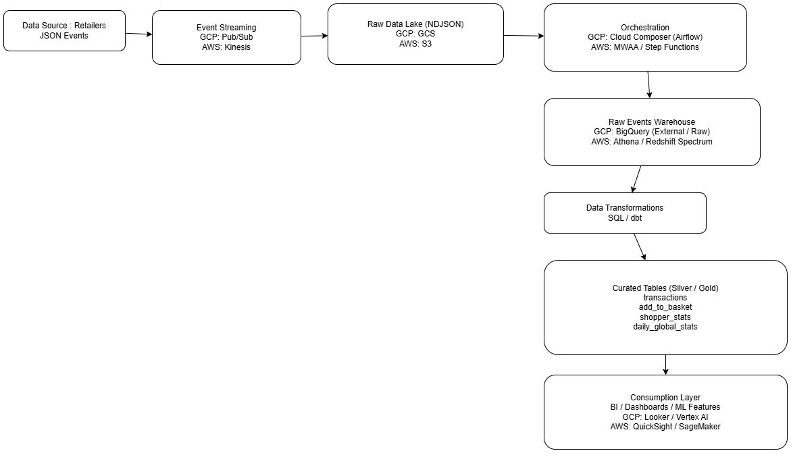

## Architecture de la data plateforme 

Puisque les données de transactions sont reçues depuis les sites des retailers sous forme d’événements JSON, je propose de mettre en place un système qui les injecte automatiquement dans une zone d’atterrissage au sein d’un Data Lake, constituant la raw layer. Ensuite, nous pourrons utiliser différents services pour transformer et structurer les données, afin de préparer des tables et KPIs exploitables pour la BI. Cette architecture peut être mise en œuvre aussi bien sur AWS que sur GCP, en suivant la même logique, selon les services disponibles. Pour ce projet, j’ai utilisé principalement BigQuery afin de pouvoir écrire et tester facilement les requêtes SQL nécessaires aux transformations et analyses.




1. Retailers (JSON events)
Les sites partenaires envoient les événements utilisateurs (ajout au panier, validation, annulation) au système via Pub/Sub, permettant une ingestion en quasi temps réel et fiable.

2. GCS Raw Layer (partitioned)
Tous les fichiers JSON bruts sont stockés dans Google Cloud Storage, organisés par année/mois/jour/heure. Cette couche conserve les données originales pour l’historisation et la ré-ingestion si nécessaire.

3. Cloud Composer DAG
Un workflow orchestré (Cloud Composer / Airflow) automatise l’ingestion, la validation, la transformation et le chargement des données dans BigQuery, en gérant les dépendances et le monitoring des pipelines.

4. BigQuery Raw Events
Les données brutes sont stockées dans une table BigQuery partitionnée, permettant d’accéder facilement aux événements, de contrôler la qualité des données et de gérer les doublons.

5. Transformation (SQL / dbt)
Les données brutes sont transformées en tables structurées (transactions, add_to_basket, shopper_stats, daily_global_stats) via SQL ou dbt, préparant des datasets agrégés, fiables et exploitables pour l’analytics et le machine learning.

6. Silver / Gold Layer
Les tables transformées constituent les couches curated de la plateforme :

**transactions** : dernier statut de chaque panier

**add_to_basket** : quantité ajoutée ou retirée par produit

**shopper_stats** : statistiques par utilisateur

**daily_global_stats** : KPIs globaux par jour

7. Dashboards / BI / ML Features
Les données finales alimentent des dashboards BI (Looker / Data Studio) ou Tableau ou Power BI et servent à créer des features pour le machine learning, permettant de suivre les KPIs, analyser le comportement des shoppers et optimiser la stratégie commerciale.

## Les requetes SQL 

Pour simplifier l’exemple, j’ai utilisé un fichier JSON stocké dans GCS, et pour accéder directement aux données dans BigQuery, j’ai créé une table externe qui contient toutes les informations arrivant dans le Data Lake. La requête SQL correspondante est décrite ci-dessous. Ensuite, cette table externe sert de source pour créer les tables nécessaires ou les tables intermédiaires. Bien sûr, comme indiqué dans l’architecture, dans un contexte de production il serait nécessaire d’utiliser des services et des approches plus sophistiquées pour transférer et transformer les données depuis GCS vers BigQuery et pour assurer l'actualisation des données aussi. Enfin, le fichier stocké dans le Data Lake doit être au format NDJSON pour que les requêtes fonctionnent correctement.

Le nom de dataset dans BigQuery est lucky_cart. 

```sql
CREATE OR REPLACE EXTERNAL TABLE lucky_cart.raw_events_ext
WITH PARTITION COLUMNS (
  year INT64,
  month INT64,
  day INT64,
  hour INT64
)
OPTIONS (
  format = 'JSON',
  uris = ['gs://lucky-cart-raw-events/*'],
  hive_partition_uri_prefix = 'gs://lucky-cart-raw-events/'
);
```

Aprés la construction de cette table exterieure , j'ai créé une autre table nommée raw_events dans bigquery avec cette requete . Cette table va alimenter les tables qu'on doit créer pour répondre aux questions et les insights demandés. 

```sql
CREATE OR REPLACE TABLE lucky_cart.raw_events
PARTITION BY event_date AS
SELECT
  event_id,
  shopper_id,
  event_type,
  TIMESTAMP(event_timestamp) AS event_timestamp,
  payload,
  CURRENT_TIMESTAMP() AS ingestion_timestamp,
  DATE(TIMESTAMP(event_timestamp)) AS event_date,
  year, month, day, hour
FROM lucky_cart.raw_events_ext;
```

### La table transactions

Pour la création de la table transactions, on trouve la requête correspondante dans le fichier `q1_create_transactions_table.sql` . La logique est de construire pour chaque transaction son dernier état enregistré, en tenant compte des différents événements (cartUpdated, cartValidated, cartCanceled) envoyés par les retailers. Pour cela, on utilise ROW_NUMBER() OVER (PARTITION BY transaction_id ORDER BY event_timestamp DESC) afin de ne conserver que l’événement le plus récent pour chaque transaction. Cette table reflète donc le dernier statut de chaque panier, ce qui permet ensuite de calculer des métriques fiables, comme le nombre de paniers validés, abandonnés, ou la valeur totale des transactions.

### La table add_to_basket 

Pour la création de la table add_to_basket, j’ai d’abord construit une table intermédiaire cart_products qui extrait, pour chaque événement cartUpdated, les produits présents dans chaque panier en dépliant le tableau products grâce à UNNEST. Cette table contient le transaction_id, le shopper_id, l’event_timestamp, ainsi que l’identifiant et la quantité de chaque produit.

Ensuite, j’ai créé la table add_to_basket à partir de cette table intermédiaire. La logique consiste à comparer, pour chaque transaction et produit, la quantité actuelle avec la quantité précédente (LAG(quantity)) afin de déterminer si un produit a été ajouté, retiré ou inchangé. La table finale enregistre le quantity_delta ainsi que le type d’action (added / removed), permettant de suivre précisément les modifications des paniers au fil du temps. La syntaxe complète se trouve dans le fichier `q2_create_add_to_basket.sql`.

### La table shopper_stats 

La table shopper_stats permet de regrouper des statistiques clés par shopper afin d’analyser leur comportement d’achat. Elle agrège les événements pour calculer l’activité globale de chaque utilisateur (première et dernière interaction), le nombre total de transactions, les paniers validés et annulés, ainsi que le taux de conversion. Elle inclut également des indicateurs business comme le montant total dépensé, le panier moyen et la durée moyenne des transactions. Enfin, des dimensions de segmentation sont ajoutées, telles que le nombre de magasins visités et la liste des stores fréquentés, afin de faciliter l’analyse et la segmentation des shoppers. On trouve le code sql permettant de créer la table dans le fichier `q3_create_shopper_stats.sql`.

### La table daily_global_stats 

La table daily_global_stats permet de calculer des indicateurs globaux agrégés par jour afin de suivre la performance business de la plateforme. Elle se base sur le dernier état de chaque panier pour mesurer l’activité quotidienne, comme le nombre de shoppers actifs, les paniers créés, validés ou abandonnés, ainsi que le taux de conversion des paniers. Elle inclut également des métriques sur le contenu des paniers (nombre moyen de produits, produits distincts), la valeur des achats (panier moyen, chiffre d’affaires total) et la répartition des achats par device (mobile, desktop, autres). Le syntaxe de la création de cette table se trouve dans le fichier `q4_create_daily_global_stats.sql`.
